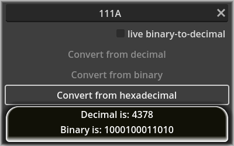

# decbinhex

A number converter program, updated to Godot 4. Available functionality depends on text entered. Has limited live-conversion available.

Extras:

- A polygon with basic movement (unhide Polygon class, arrows/wasd), separate add-on
- Minimum and maximum window size (don't do this with games, it only makes sense here because this is not the type of GUI that looks good maximized)
- A simple benchmark (I'm not sure what it actually correlates to, but uncomment the last line in method ready of main_class.nim)

Compare to the code of the 3.X bindings version originally contributed here: https://github.com/zetashift/godotnim-samples/tree/master/decbinhex

Known annoyance, not code-related: The GUI being able to shift size means that the window looks slightly off when scaled to the smallest size when displaying a result. The old version was smaller by default and did not have that issue.
